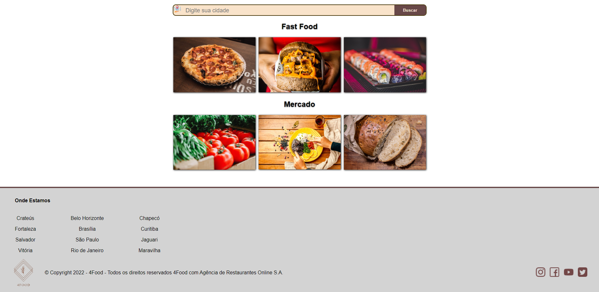
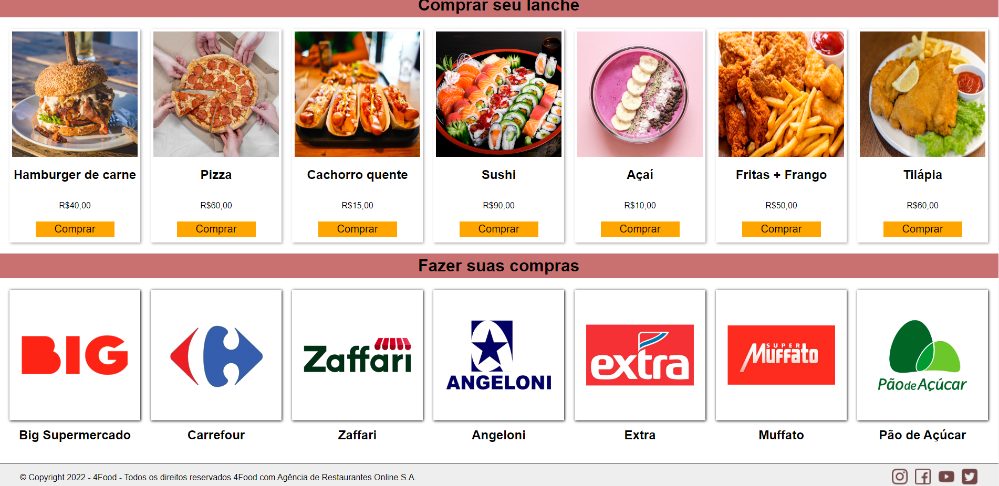
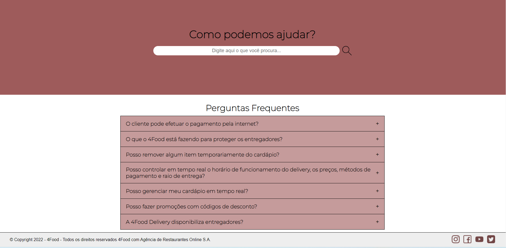
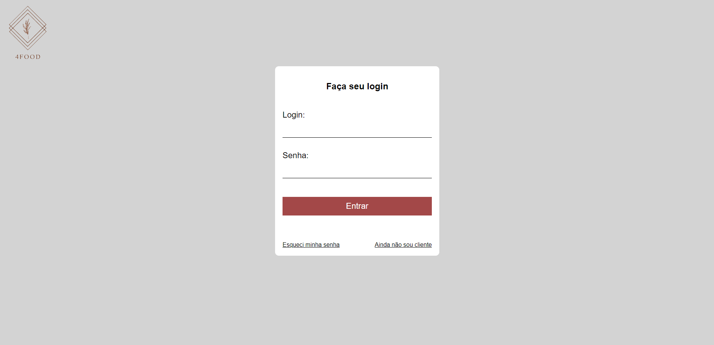
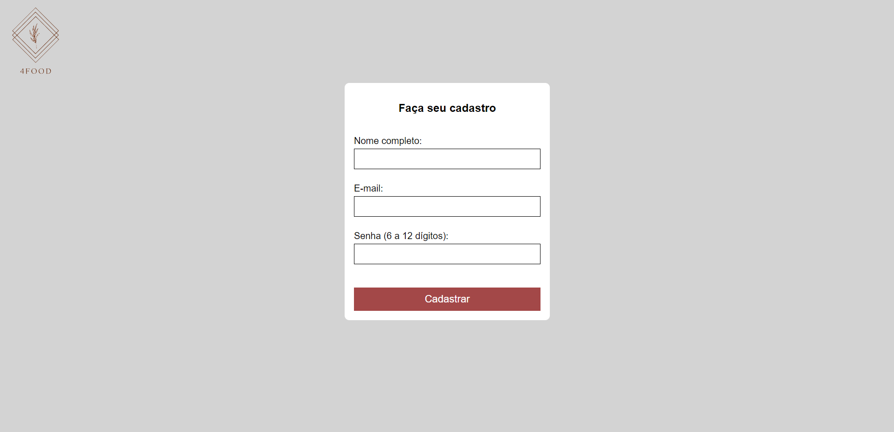
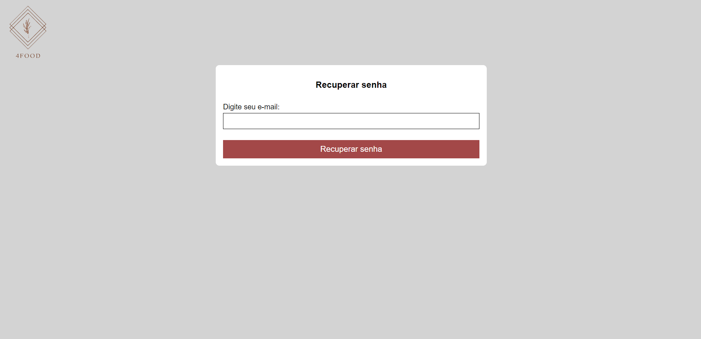

# Projeto
Site 4Food

# Link
http://4food-alves.surge.sh/

# Descrição
4Food é um sistema de compras e entregas recorrentes por aplicativo. O sistema possibilita a realização de compras de supermercado online e também de lanches prontos (fast food). Para organização, o site é composto por um menu superior, horizontal, no qual existem as seguintes abas:  
-> Início  
-> Fazer pedido  
-> Quem somos  
-> FAQ  
-> Login  
-> Registrar  
-> Recuperar senha  
Ainda, existem algumas opções de iteração do usuário com o sistema, como por exemplo:  
-> Links para redes sociais  
-> Espaços para campos de busca

# O que não funciona
- Aba Início
    - Campo de busca
- Aba Fazer pedido
    - Botão "Comprar"
    - Botão dos cards de mercados
- Aba FAQ
    - Campo de busca
- Aba Loginimage.png
    - Botão "Entrar"
- Aba Registrar
    - Botão "Cadastrar"
- Aba Esqueci minha senha
    - Botão "Recuperar senha"

# Tecnologias utilizadas

# Autores
Márleo Piber da Rosa, Olavo Marques do Nascimento, Evandro Paulo Folletto

# Imagens

## Aba "Início"

## Aba "Fazer pedido"

## Aba "Quem somos"

## Aba "FAQ"

## Aba "Login"

## Aba "Registrar"

## Aba "Restaurar senha"

